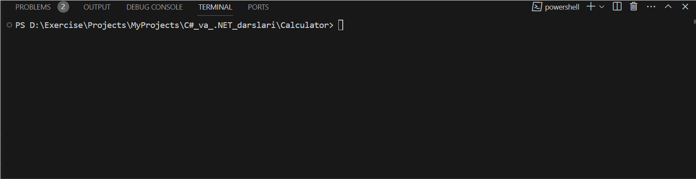

# Calculator

## overview
    
This project shows how I can succesfully use data types & amp; arithmetic operations

Have look at `program.cs` find and you can see how I have used:

* Console input/output
* Convesrion between data types
* Arithmetic operations

## Demo

